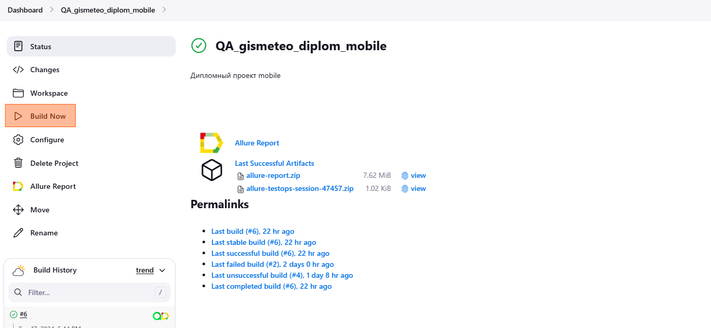
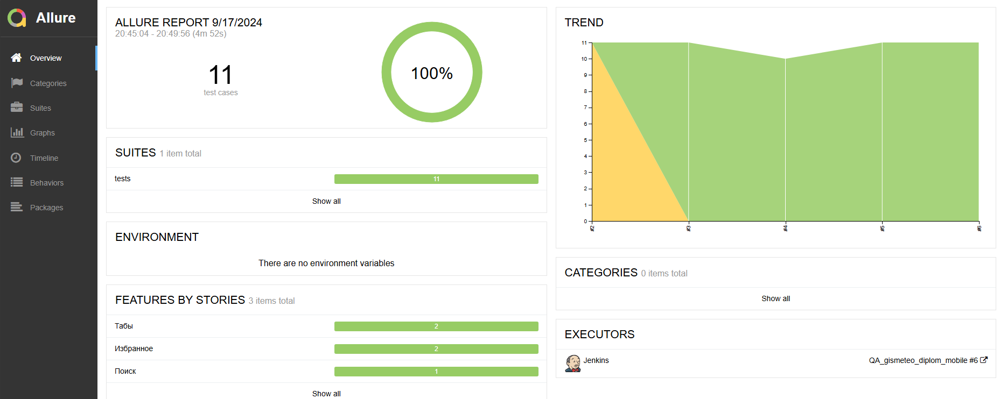
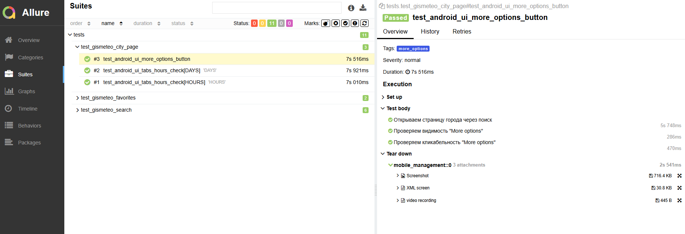
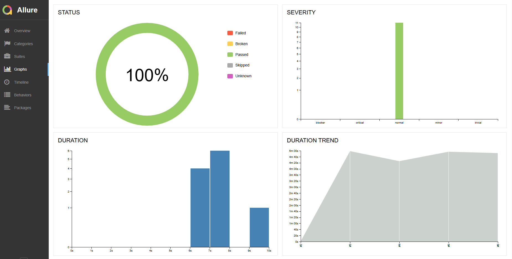
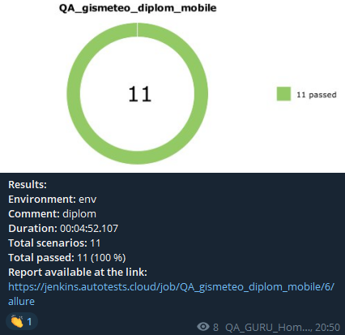
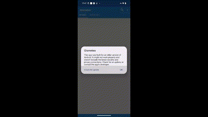

# Проект по автоматизации тестирования UI мобильного приложения Gismeteo
<a target="_blank" href="https://www.gismeteo.ru/soft-mobile/">Сайт проекта</a>

## 📄 Содержание
- [Технологии и инструменты](#tech_and_ins-технологии-и-инструменты)
- [Примеры UI тестов](#pager-Примеры-UI-тестов)
- [Сборка в Jenkins](#-Сборка-в-Jenkins)
- [Allure отчет](#-Allure-отчет)
- [Отчет в Telegram с помощью бота](#-Отчет-в-Telegram-с-помощью-бота)
- [Видео прохождения тестов на BrowserStack](#film_projector-Видео-прохождения-тестов-на-BrowserStack)

## :wrench: Технологии и инструменты

В данном проекте автотесты написаны на <code>Python</code> с использованием <code>BrowserStack</code>, <code>Appium</code> и <code>Pytest</code> для UI-тестов
>
> <code>BrowserStack</code> выполняет запуск браузеров на отдельных удалённых смартфонах под управлением ОС <code>Android</code>.
>
> <code>Allure Report</code> формирует отчет о запуске тестов.
>
> <code>Jenkins</code> выполняет запуск тестов.
> После завершения прогона отправляются уведомления с помощью бота в <code>Telegram</code>.

## :pager: Примеры UI тестов
- Проверка добавления города в "Избранное"
- Проверка работоспособности поиска
- Проверка корректности наименования заголовка страницы с городом
- Проверка навигационого бара
- Проверка работоспособности кнопки "More options" 

## </a> Сборка в Jenkins с параметрами
> <code>Jenkins</code> выполняет запуск тестов.
> После завершения прогона отправляются уведомления с помощью бота в <code>Telegram</code>. 
>
>Также реализованы конфиги с запуском тестов на физическом устройстве и эмуляторе Android (Примечание: только локальный запуск!).
>
>Для изменения конфига необходимо при запуске тестов через pytest указать параметр context <code> pytest --context=local </code>.
>
>По умолчанию используется конфиг <code>BrowserStack</code>
>
> Запуск джоба происходит по нажатию кнопки <code>Build now</code>

## </a> Allure отчет
>
> Allure формирует подробный отчет о прогоне тестов. Кастомные фильтры и листенеры делают отчет максимально понятным
>
> Например отчеты формируются по категориям, в конце приложен скриншот, видео запись прогона теста и XML документ.

##  Отчет в Telegram с помощью бота
>
> После прогона всех тестов в <code>Telegram</code> чат автоматически приходит сообщение с полной информацией о прогоне и ссылкой на <code>Allure</code>
>

## :film_projector: Видео прохождения тестов на BrowserStack
>
> <code>BrowserStack</code> пишет видео прогона каждого теста и видео прикладывается в отчет <code>Allure</code>
>

